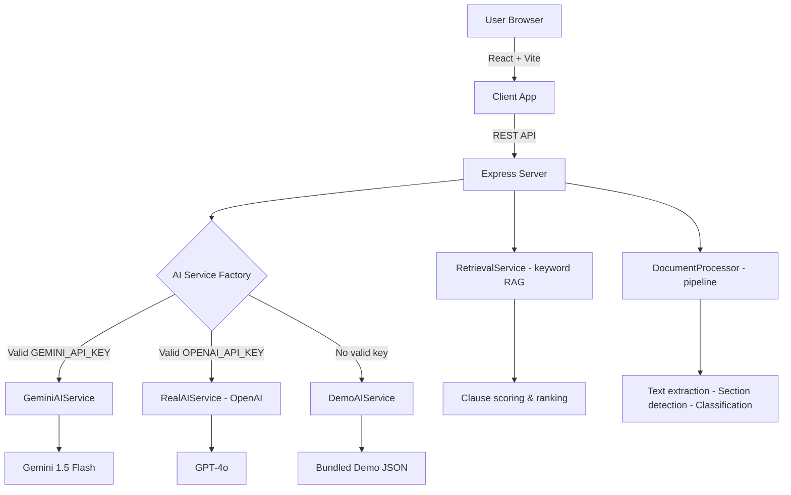

# ClauseLens — AI-Powered Legal Document Navigator

> **Understand the fine print. Know what to ask next.**

ClauseLens is a full-stack web application that transforms complex legal documents into clear,
traceable, and actionable insights — without replacing legal professionals.

---

## Problem

Most people who receive a legal document — an employment agreement, a service contract, a lease —
read it once, understand perhaps 60% of it, and sign without knowing which clauses deserve extra
attention or what questions to ask a lawyer. Legal language is deliberately precise but rarely
accessible. The consequences of misunderstanding a clause can be significant.

---

## Solution

ClauseLens provides a document-intelligence interface that:

- Detects and categorises every important clause
- Explains each clause in plain English
- Cites the exact section and page for every finding
- Answers natural-language questions grounded in the document
- Extracts and organises obligations by party
- Produces a visual timeline of key dates
- Compares two versions of the same document
- Generates a structured consultation brief for a legal professional

The central design principle is: **every important AI-generated finding must be traceable
to the relevant clause in the document.**

---

## Key Features

| Feature | Description |
|---|---|
| Clause Detection | Identifies and categorises clauses: financial, termination, restrictions, ownership, disputes, time |
| Attention Areas | Highlights clauses that may warrant closer review (High / Medium / Low) |
| Evidence-Backed Q&A | Answers grounded in the document, with quoted evidence and source citation |
| Obligation Extractor | Who must act, trigger, deadline, consequence, source |
| Visual Timeline | Chronological view of key dates and obligations |
| Contract Comparison | Side-by-side diff of two document versions with plain-English explanations |
| Lawyer Preparation | Structured consultation brief with targeted questions and document checklist |
| Demo Mode | Fully functional without any API key — runs on bundled fictional documents |

---

## Architecture



---

## How It Works

```
Upload / Select Document
        ↓
  Text Extraction
        ↓
  Section Detection
        ↓
  Clause Segmentation
        ↓
  Clause Classification
        ↓
  Obligation Extraction
        ↓
  Attention Detection
        ↓
  Evidence Mapping
        ↓
  Q&A Retrieval (simplified RAG)
        ↓
  Explain + Cite
```

For Q&A, the application uses a **keyword-based retrieval pipeline** before answering:
1. The question is tokenised and scored against all clauses
2. The top-k most relevant clauses are retrieved
3. The AI service constructs a grounded answer from those clauses
4. The answer is returned with source citation

This demonstrates the RAG (Retrieval-Augmented Generation) architecture without requiring
a cloud vector database.

---

## AI Approach

The application uses an **AIService abstraction** with three implementations:

### DemoAIService (default — no API key needed)
- Backed by richly structured JSON data for two fictional employment agreements
- Deterministic responses — works instantly, no network calls
- Fully covers: analysis, clause extraction, obligations, Q&A, comparison, consultation brief

### GeminiAIService (recommended — requires `GEMINI_API_KEY`)
- Uses Google Gemini 1.5 Flash (`gemini-1.5-flash`) via `@google/generative-ai`
- JSON-mode responses with the same safety system prompt as Demo Mode
- Set `GEMINI_API_KEY` in `server/.env` to activate

### RealAIService (legacy — requires `OPENAI_API_KEY`)
- Uses OpenAI GPT-4o via the `openai` npm package
- Kept for compatibility — prefer Gemini for new deployments

The factory (`services/ai/index.js`) selects automatically and validates key format:

```
GEMINI_API_KEY set & valid  →  GeminiAIService   (recommended)
OPENAI_API_KEY set          →  RealAIService     (legacy)
no valid key / invalid key  →  DemoAIService     (default, fully functional)
```

> **Note:** A Gemini API key is considered valid if it starts with `AIza` and is ≥ 39 characters.
> An invalid key automatically falls back to DemoAIService instead of crashing.

---

## Safety

ClauseLens clearly distinguishes between:

1. **Document fact** — "What the contract states"
2. **Explanation** — "Plain-English interpretation of the wording"
3. **Legal advice** — "What a lawyer would need to determine" (not provided)

The application uses language such as:
- "The document states…"
- "The wording appears to…"
- "This may be worth reviewing…"
- "A legal professional can assess how this applies to your situation."

It never claims a clause is enforceable or illegal, never advises on litigation, and
clearly labels all attention areas as provisions worth reviewing — not legal risk scores.

Out-of-scope questions (e.g. "Should I sue my employer?") receive a structured response
explaining the limitation and offering to help with document-based preparation instead.

---

## Security

- API keys are **never** exposed to the frontend — all AI calls happen server-side
- Environment variables are used for all secrets (`.env`, never committed)
- File uploads use in-memory storage only — never written to disk unnecessarily
- File type validation and size limits enforced on upload (5 MB, text/plain only for live mode)
- Filenames are sanitised before use
- Rate limiting applied to all API routes (100 req / 15 min per IP)
- Helmet.js security headers enabled
- CORS configured to allowed origins only
- No real personal data used anywhere in the application

---

## Testing

The test suite covers:
- Clause extraction and categorisation
- Obligation extraction and party grouping
- Q&A retrieval (keyword scoring)
- Source mapping (clauses → sections)
- Document comparison (change detection)
- Out-of-scope and not-found handling
- Safety responses
- Demo mode fallback
- All API routes (integration tests with Supertest)

```bash
cd server
npm test
```

Expected output: **92 tests passing** across 3 test suites.

---

## Running Locally

### Prerequisites

- Node.js 18+
- npm 9+
- Git

### Quick Start (Demo Mode — no API key needed)

```bash
# 1. Clone the repository
git clone https://github.com/YOUR_USERNAME/clauselens.git
cd clauselens

# 2. Install all dependencies
cd server && npm install
cd ../client && npm install
cd ..

# 3. Start the server (terminal 1)
cd server && npm run dev

# 4. Start the client (terminal 2)
cd client && npm run dev

# 5. Open in browser
# http://localhost:5173
```

### With OpenAI (optional)

```bash
# Create server/.env from the template
cp .env.example server/.env

# Add your API key
# OPENAI_API_KEY=sk-...

# Then start as above — the app auto-detects the key
```

---

## Demo Walkthrough (under 60 seconds)

1. Open `http://localhost:5173`
2. Click **"Try Demo"** or navigate to **Dashboard**
3. Click **"Analyse Document"** on Employment Agreement v2
4. View the **Overview** tab — see clause count, attention areas, summary
5. Click **"Attention"** tab — expand a High Attention area, click the source link
6. Click **"Q&A"** tab — ask "What is the notice period?" or click a suggested question
7. Navigate to **Compare** — click "Compare Documents"
8. See the notice period change: 30 days → 90 days, and all other changes
9. Back on the Analysis page, click **"Prepare for Lawyer"** — generate a consultation brief

---

## Chosen Vertical

**Employment Agreement Review**

Demo persona: An employee who has received an employment agreement and wants to understand
its key provisions before discussing it with a legal professional.

---

## Assumptions

- The primary evaluation path uses the bundled demo documents (no API key needed)
- The "attention level" concept is used instead of "legal risk score" — the application
  identifies provisions worth reviewing, not legally enforceable risks
- Document text is displayed as pre-formatted text in the viewer (no PDF rendering library,
  to keep the repository under 10 MB)
- The RAG implementation uses keyword scoring rather than vector embeddings (no cloud DB required)
- All demo monetary values are in Indian Rupees (₹) for the fictional Nexus Technologies scenario

---

## Project Structure

```
clauselens/
├── client/                    React + Vite + Tailwind CSS frontend
│   └── src/
│       ├── components/        Shared UI components (Layout, DemoBanner, ui/)
│       ├── features/          Feature modules (analysis, qa, obligations, timeline, consultation, comparison)
│       ├── pages/             Route pages (HomePage, DashboardPage, AnalysisPage, ComparisonPage)
│       └── services/          API client (axios)
├── server/                    Express.js backend
│   ├── controllers/           Request handlers
│   ├── routes/                Express router definitions
│   ├── services/
│   │   ├── ai/                AIService abstraction + DemoAIService + RealAIService
│   │   ├── document/          DocumentProcessor pipeline
│   │   └── retrieval/         RetrievalService (keyword RAG)
│   ├── data/demo/             Bundled fictional employment agreements + Q&A responses
│   └── tests/                 Jest test suites (71 tests)
├── .env.example               Environment variable template
├── .gitignore
└── README.md
```

---

*ClauseLens — Built for the GenAI Legal Assistance Challenge*
